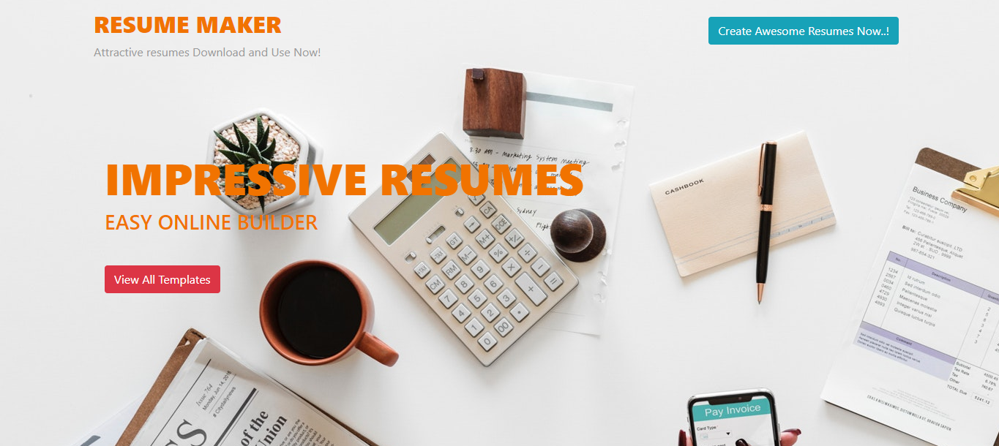
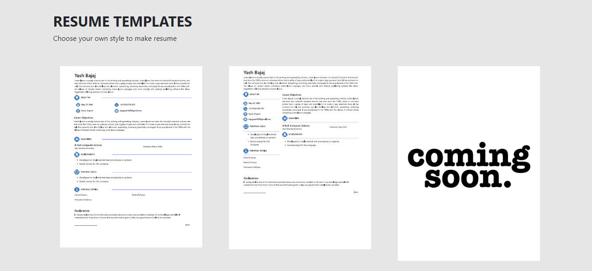
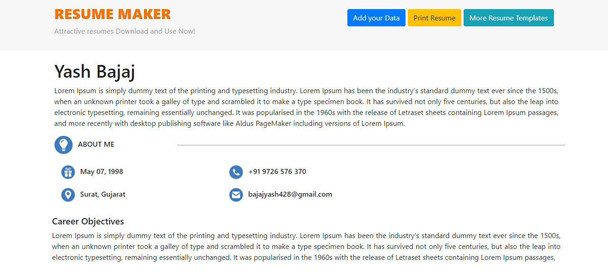
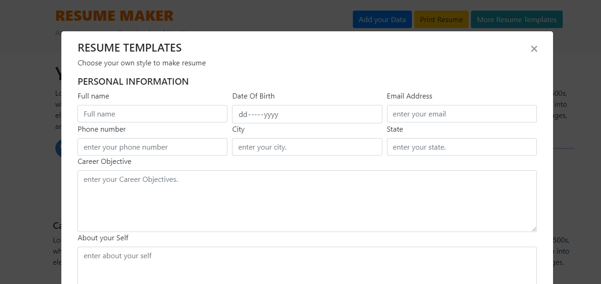
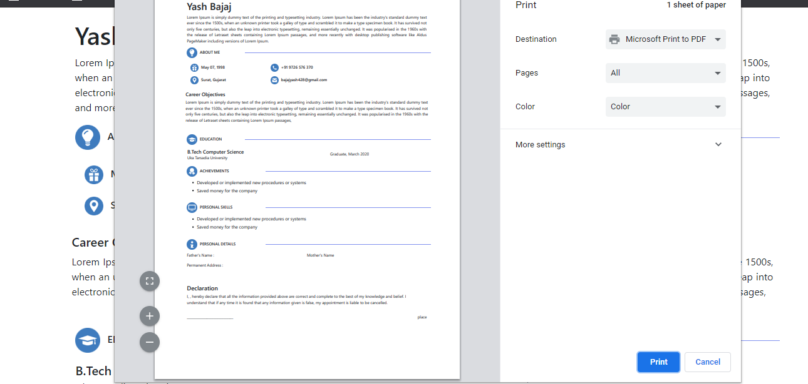

# Resume-Builder-Using-FLask
This project is to create a dynamic website in which you can generate your CV. I use Flask as minimalistic framework that allows to write very concisely web apps and plays nicely with a bunch libraries. Flask is one such library that allows to write content in Markdown and have it automatically converted to the equivalent html. Finally, Frozen-Flask can be used to "build" static Flask applications, turning everything into a collection of static html/css files that can be put on a web server (Tomcat, python) without needing additional technologies.
In this Project you can also generate the pdf by clicking on the Print button.

https://github.com/yash42828/Resume-Builder-Using-FLask

## Screenshots

